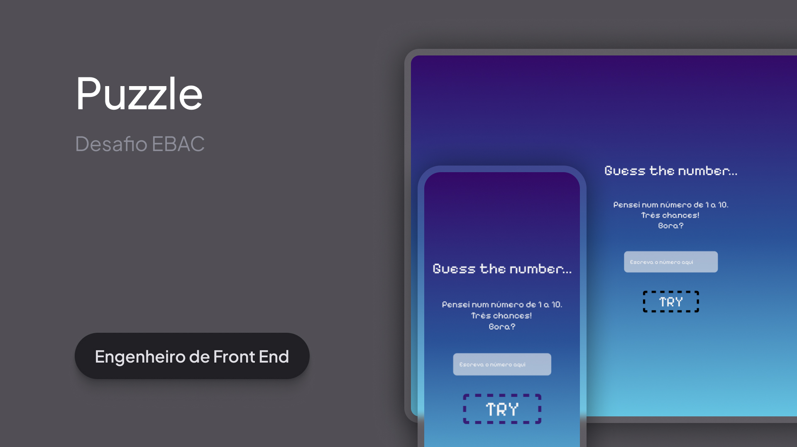

<h1 align="center">Puzzle</h1>

Projeto da formação de #Engenheiro Front End.

  <a href="#-tecnologias">Tecnologias</a>&nbsp;&nbsp;&nbsp;|&nbsp;&nbsp;&nbsp;
  <a href="#-projeto">Projeto</a>&nbsp;&nbsp;&nbsp;|&nbsp;&nbsp;&nbsp;
  <a href="#-estude">Estude com a Ebac</a>&nbsp;&nbsp;&nbsp;|&nbsp;&nbsp;&nbsp;

 

  

## 🚀 Tecnologias

Esse projeto foi desenvolvido com as seguintes tecnologias:

- HTML e CSS
- JavaScript
- Git e Github
- Figma

## 💻 Projeto

O projeto prático consistia em criar um jogo de adivinha de forma responsiva.

- [Acesse o projeto finalizado](https://github.com/itsjrsouza/puzzle)

## 🔖 Estude

Quer ter o prazer de desenvolver esse projeto e outros e ainda ganhar um desconto de R$ 350,00? Vem estudar com a Ebac!

[Ebac](https://ebaconline.com.br/sale/referral?grsf=pvn0o7)